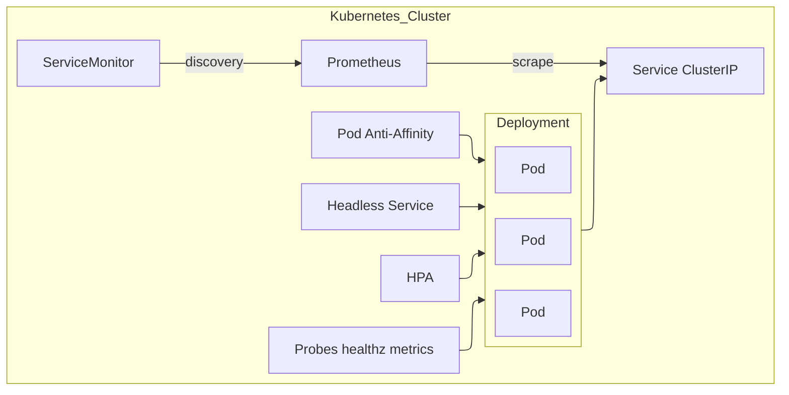
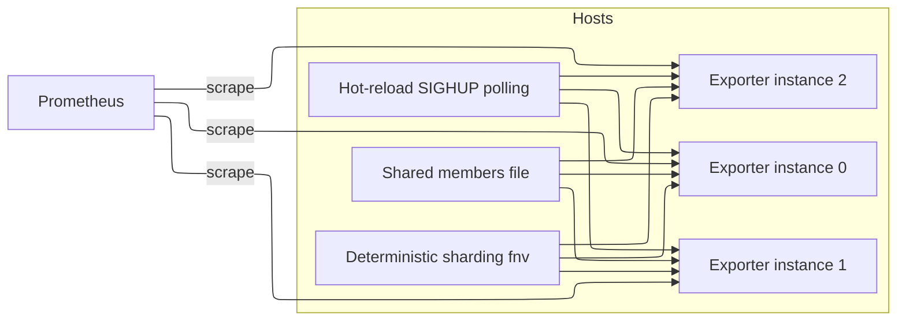

# multicloud-exporter 集群与并行架构设计

> 更新记录：2025-12-08；修改者：@jangrui；内容：补充 Period 自动适配、来源优先级与统一指标映射；校准组件说明与技术选型。

## 1. 云原生架构（Kubernetes）

### 1.1 架构图（Mermaid）



### 1.2 关键点

- 副本与伸缩：`replicaCount` + `HPA`（CPU 70% 目标，`minReplicas`/`maxReplicas` 可调）。
- 服务发现与负载：`Service` 提供负载均衡；可选 `Headless Service` 提供 Pod IP 列表用于成员发现。
- 反亲和与调度优化：通过 `affinity`/`topologySpreadConstraints`（Chart 可配置）实现跨节点扩散。
- 健康检查：容器暴露 `GET /healthz`（存活探针）与 `GET /metrics`（就绪探针）。
- 指标采集与导出：使用 `ServiceMonitor` 或原生注解方式供 Prometheus 抓取。
- Period 自动适配：未显式配置时，采集器调用云侧元数据接口选择指标的最小可用 `Period`，以与 `server.scrape_interval` 保持一致；实现位置见 `internal/providers/tencent/tencent.go:136-197`，调用点 `internal/providers/tencent/clb.go:79-83`、`internal/providers/tencent/bwp.go:75-79`，阿里云参考 `internal/providers/aliyun/aliyun.go:561-615`。

### 1.3 Helm 关键配置

- `values.yaml`：
  - `replicaCount`: 副本数。
  - `hpa.enabled`, `hpa.minReplicas`, `hpa.maxReplicas`, `hpa.metrics`: 自动伸缩规则。
  - `probes.liveness`, `probes.readiness`: 健康探针。
  - `headless.enabled`, `headless.name`: 是否启用 Headless Service。
  - `cluster.discovery`: `headless` | `file` | 空；`cluster.svcName`/`cluster.file` 配合使用。

- 模板：
  - `templates/deployment.yaml` 支持 `replicaCount`、探针、Cluster 相关环境变量、Downward API 注入。
  - `templates/hpa.yaml`（启用时渲染）。
  - `templates/service.yaml` 提供对外服务与 Prometheus 抓取入口。
  - `templates/headless-service.yaml`（可选）为成员发现提供 Pod IP 解析。
  - `templates/servicemonitor.yaml`（如使用 Operator）。

### 1.4 实现步骤

- 设置 `replicaCount` 与资源请求，部署服务。
- 根据负载开启 `hpa.enabled` 并配置目标指标（CPU或自定义）。
- 如需成员分片，在 `values.yaml` 中设置：
  - `headless.enabled: true`，并将 `cluster.discovery: headless`，`cluster.svcName` 指向 headless 服务名。
- 如需强约束调度，配置 `affinity`/`topologySpreadConstraints`。
- 使用 `ServiceMonitor` 或在 `Service` 上配置抓取注解，完成 Prometheus 集成。
- 配置 Period 与采集频率：`server.scrape_interval` 推荐与云侧最小 `Period` 一致；Chart 文档与 README 已补充说明。

## 2. 传统宿主机并行架构

### 2.1 架构图（Mermaid）



### 2.2 核心算法

- 成员发现（K8s/宿主机通用）：`internal/utils/sharding.go` 的 `ClusterConfig` 函数。
    - `headless`: 解析 `CLUSTER_SVC` DNS 获取 Pod IP 列表，匹配 `POD_IP` 得到 `(wTotal,wIndex)`。
    - `file`: 读取 `CLUSTER_FILE` 列表，与 `POD_NAME`/`HOSTNAME` 匹配计算 `(wTotal,wIndex)`。

- 分片与路由：
  - 核心算法：集中于 `internal/utils/sharding.go`，提供 `ClusterConfig`（获取总分片数与当前索引）与 `ShouldProcess`（判断是否处理当前 Key）。
  - 分片策略：
    - 仅启用**云厂商层级（Provider-level）**分片，由各 Provider 在采集循环内部调用 `ShouldProcess(AccountID|Region)`。
    - **已移除** Collector 层级的账号分片，以防止跨区域账号被错误地整体跳过（解决 Double Sharding 问题）。
  - 区域级分片：`internal/providers/aliyun/aliyun.go` 与 `internal/providers/tencent/tencent.go` 在采集时调用 `ShouldProcess`。
  - 哈希函数：`ShardIndex` 在 `internal/utils/sharding.go`，使用 FNV-32a 算法。

- 配置热更新：
  - K8s：使用 ConfigMap + `stakater/reloader` 注解已集成；Chart 已支持。
  - 宿主机：SIGHUP 信号触发配置重载，或定时轮询文件更新时间（推荐 15–60s）。

### 2.3 关键环境变量

- `CLUSTER_DISCOVERY`: `headless`/`file`/空。
- `CLUSTER_SVC`: 成员服务名（headless）。
- `CLUSTER_FILE`: 成员列表文件路径（file）。
- `CLUSTER_WORKERS`/`CLUSTER_INDEX`: 静态分片参数回退。

## 3. 通用要求实现

### 3.1 监控指标

- 采集成效与性能：
  - `collection_duration_seconds` 在 `cmd/multicloud-exporter/main.go:128` 统计周期时长。
  - `request_total` 与 `request_duration_seconds` 在各 provider 中记录云 API 成功/失败与耗时。
  - `rate_limit_total` 统计限流触发次数。
  - 资源指标：统一暴露在 `metrics.NamespaceMetric`/`metrics.ResourceMetric`，示例见 `internal/metrics/*`。
- 统一命名与映射：通过 `configs/mappings/*.yaml` 与别名函数保持跨云一致（如 ALB/BWP/CBWP/CLB/COS/NLB/GWLB/OSS）；Aliyun SLB 别名函数见 `internal/metrics/aliyun/slb.go:22-46`，Tencent CLB 别名注册见 `internal/metrics/tencent/clb.go:9-32`，BWP 前缀注册见 `internal/metrics/tencent/bwp.go:9-18`。

### 3.2 自动化部署

- Kubernetes：
  - 安装：`helm install mce ./chart -f values.yaml`。
  - 副本与伸缩：设置 `replicaCount`，或启用 `hpa.enabled`。
  - 成员发现：`headless.enabled: true`；`cluster.discovery: headless`；`cluster.svcName: <svc-name>`。
  - 健康检查：`probes.liveness/readiness` 默认启用。
  - 认证与安全：`server.admin_auth_enabled` 启用管理接口 BasicAuth；通过 Ingress/ServiceMesh 终止 TLS；云 SDK 强制 HTTPS。

- 宿主机：
  - Systemd 单元示例：
    ```
    [Unit]
    Description=multicloud-exporter
    After=network.target

    [Service]
    ExecStart=/usr/local/bin/multicloud-exporter
    Environment="SERVER_PATH=/etc/mce/server.yaml"
    Environment="CLUSTER_DISCOVERY=file"
    Environment="CLUSTER_FILE=/var/run/mce/members.txt"
    Restart=always

    [Install]
    WantedBy=multi-user.target
    ```
  - Prometheus `static_configs` 指向各实例 `:9101`。

### 3.3 高可用与故障转移

- K8s：Deployment 多副本 + HPA；探针失败自动重启；Pod 反亲和减少同机失败概率；Prometheus 多 target 抓取容错。
- 宿主机：多实例并行；外部维护成员列表文件（自动化运维工具更新）；分片哈希稳定，实例宕机后剩余实例仍覆盖其分片（通过总成员变化重算）。

### 3.4 性能指标与目标

- 采集周期建议与云 API Period 匹配（详见 README）。
- 并发控制：
  - 区域并发：`server.region_concurrency`；
  - 产品并发：`server.product_concurrency`；
  - 指标并发：`server.metric_concurrency`；
  - 最终目标：P95 周期完成时间 ≤ 周期时长的 0.6；错误率 ≤ 0.1%。
  - 基准与压力：CI 执行 `go test -bench . -benchmem -run ^$ ./...` 与并行压力 `go test -race -run . -parallel 16 ./...`，收集 `benchmem` 指标并观察限流错误。

### 3.5 平滑升级与回滚

- K8s：RollingUpdate（`maxUnavailable=0` 推荐）；保留旧版本镜像；Chart 版本化。
- 宿主机：逐台滚动，利用系统级负载均衡与 Prometheus 抓取冗余避免可见中断；可在灰度窗口观察核心指标。

## 4. 关键实现引用

- `cmd/multicloud-exporter/main.go:137` 注册 `/metrics`；`cmd/multicloud-exporter/main.go:137`–`179` 周期采集与事件流接口；`cmd/multicloud-exporter/main.go:137` 新增 `/healthz`。
- `internal/collector/collector.go:103` 成员发现；`internal/collector/collector.go:182` 账号分片；`internal/collector/collector.go:173` 哈希函数。
- `internal/providers/aliyun/aliyun.go:119` 区域分片；`internal/providers/tencent/tencent.go:52` 区域分片。
- `chart/templates/deployment.yaml`、`chart/templates/hpa.yaml`、`chart/templates/headless-service.yaml`：部署、伸缩与成员发现支持。

## 5. 配置参数总览（Helm）

- `replicaCount`
- `hpa.enabled`, `hpa.minReplicas`, `hpa.maxReplicas`, `hpa.metrics`
- `probes.liveness.*`, `probes.readiness.*`
- `headless.enabled`, `headless.name`
- `cluster.discovery`, `cluster.svcName`, `cluster.file`
- `server.*`（采集并发、日志、周期）

## 版本历史

- 2025-12-08：补充 Period 自动适配、统一指标映射与来源优先级；修改者： @jangrui。

## 6. 实施清单

- 部署前校验：`helm lint chart/`；`go build`；`go vet`。
- 监控接入：配置 `ServiceMonitor` 或抓取注解；加载 Grafana Dashboard。
- 压测与配额：根据 API 限流优化并发与周期；观察 `request_total` 的 `limit_error` 维度。
