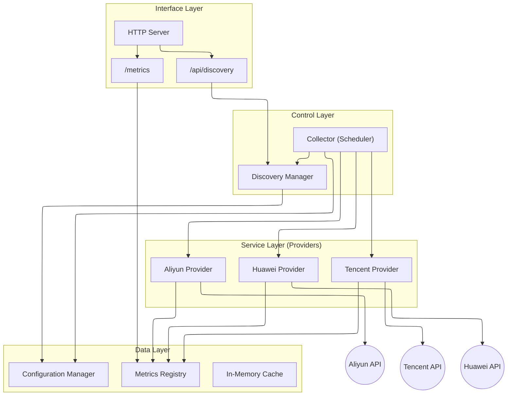

# Multicloud Exporter 逻辑架构文档

> 文档版本：v1.0.0
> 更新日期：2025-12-07

本文档旨在全盘梳理 `multicloud-exporter` 的逻辑架构，包括功能模块划分、依赖关系、业务流程、数据流向以及现有架构评估。

## 1. 架构概览

`multicloud-exporter` 采用 **Pull 模型**，周期性地从各云厂商 API 拉取监控数据，并转换为 Prometheus 格式暴露。系统设计遵循 **模块化** 和 **配置驱动** 原则。

### 1.1 架构分层图



## 2. 核心组件详解

### 2.1 Interface Layer (接口层)
- **Entry Point (`cmd/multicloud-exporter/main.go`)**: 程序的启动入口，负责初始化配置、日志、组件，并启动采集循环和 HTTP 服务。
- **HTTP Server**: 基于 `net/http`，暴露以下端点：
    - `/metrics`: 标准 Prometheus 指标接口。
    - `/api/discovery/*`: 用于查看和订阅动态发现配置的 API。

### 2.2 Control Layer (控制层)
- **Collector (`internal/collector`)**: 核心调度器。
    - 负责加载所有云账号配置。
    - 并发调度各云厂商的采集任务。
    - 管理采集周期（默认 60s）。
- **Discovery Manager (`internal/discovery`)**: 资源与配置发现管理器。
    - 负责动态发现需要采集的产品和指标配置。
    - 监听配置文件（`ACCOUNTS_PATH`）变更，实现热加载。
    - 维护当前配置的版本号 (`Version`)。

### 2.3 Service Layer (服务层 - Providers)
位于 `internal/providers/`，每个云厂商对应一个子包（如 `aliyun`, `tencent`）。
- **职责**:
    - **认证**: 管理 API 凭证 (AccessKey/Secret)。
    - **资源发现**: 调用云 API 获取 Region 列表、资源实例列表。
    - **指标采集**: 调用云监控 API (如 Aliyun CMS, Tencent Monitor) 获取监控数据。
    - **数据转换**: 将云厂商数据模型转换为 Prometheus Metric。
- **并发控制**:
    - 支持 Region 级、Product 级、Metric 级的多级并发控制。

### 2.4 Data Layer (数据层)
- **Configuration (`internal/config`)**: 负责解析 `server.yaml`, `accounts.yaml`, `mappings/*.yaml` 等配置文件。
- **Metrics Registry (`internal/metrics`)**: 定义了全局共享的 Prometheus 指标向量（Vectors），如 `ResourceMetric`。
- **Logger (`internal/logger`)**: 基于 `zap` 的结构化日志组件。

## 3. 关键业务流程

### 3.1 启动流程
1. **加载配置**: 读取 `config.yaml` 及环境变量。
2. **初始化组件**: 启动 Logger, Discovery Manager。
3. **加载映射**: 读取指标映射文件（定义云指标到 Prometheus 指标的转换规则）。
4. **启动服务**:
    - 启动 HTTP Server。
    - 启动后台采集 Goroutine。

### 3.2 采集流程 (Collection Loop)
1. **触发**: 定时器触发（默认 60s）。
2. **账号遍历**: 获取所有配置的云账号。
3. **并发调度**: 为每个账号启动一个 Goroutine。
4. **资源发现**:
    - 根据账号配置，自动发现 Region。
    - (可选) 根据 Tag 或 Resource Group 过滤资源。
5. **指标拉取**:
    - 根据配置的产品（Product）和命名空间（Namespace），调用云监控 API。
    - 使用多级并发（Region -> Product -> Metric）加速拉取。
6. **指标更新**: 将获取的数据更新到 `metrics.ResourceMetric`。

### 3.3 热加载流程
1. **监听**: Discovery Manager 轮询检查账号配置文件 (`ACCOUNTS_PATH`) 的 ModTime。
2. **重载**: 若文件变更，重新读取并解析 YAML。
3. **更新**: 更新内存中的配置对象。
4. **生效**: 下一次采集循环读取到新配置即生效。

## 4. 关键接口定义

### 4.1 Provider (采集插件)

位于 `internal/providers/registry.go`，定义了云厂商采集器的标准行为：

```go
type Provider interface {
    // Collect 执行该账号下的所有采集任务
    Collect(account config.CloudAccount)
}
```

### 4.2 Discoverer (发现插件)

位于 `internal/discovery/registry.go`，定义了云产品资源发现的标准行为：

```go
type Discoverer interface {
    // Discover 根据配置发现云产品及指标元数据
    Discover(ctx context.Context, cfg *config.Config) []config.Product
}
```

## 5. 架构演进与评估

### 5.1 架构演进 (v0.2.0)
- **插件化**：引入 `Registry` 机制，消除了 `Collector` 和 `Discovery` 中的厂商硬编码。
- **并发安全**：引入 `RWMutex` 保护配置对象，解决了 Race Condition。
- **内存管理**：实现了 `metrics.Reset()` 策略，解决了长期运行的内存增长问题。

### 5.2 现有优势
1. **高扩展性**: 新增云厂商只需实现 `Provider` 和 `Discoverer` 接口并在 `init()` 中注册，无需修改核心代码。
2. **配置驱动**: 高度可配置，支持通过 YAML 定义指标映射。
3. **并发性能**: 细粒度的并发控制（Region -> Product -> Metric）。
4. **可观测性**: 内置了 API 延迟、限流、采集耗时等自身监控指标。

### 5.3 待优化项
1. **无状态化**: 目前 Discovery 仍部分依赖本地配置文件，未来可对接远程 Service Discovery。
