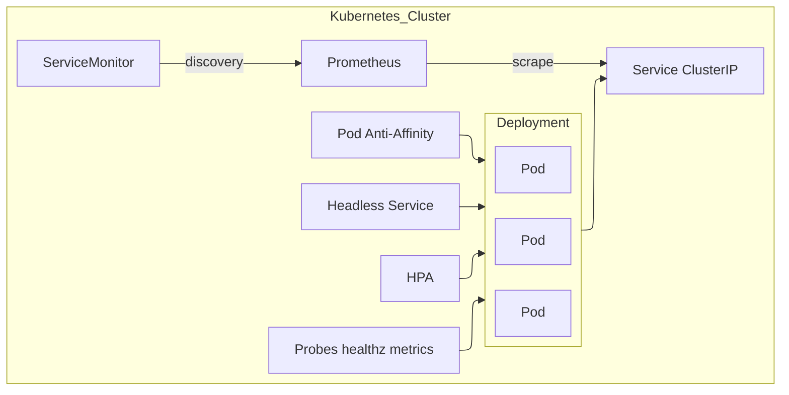
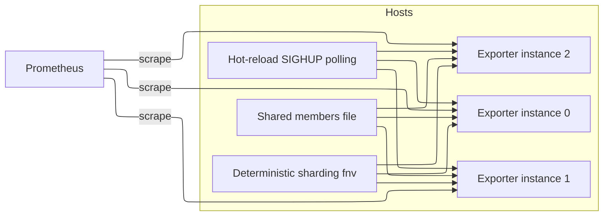
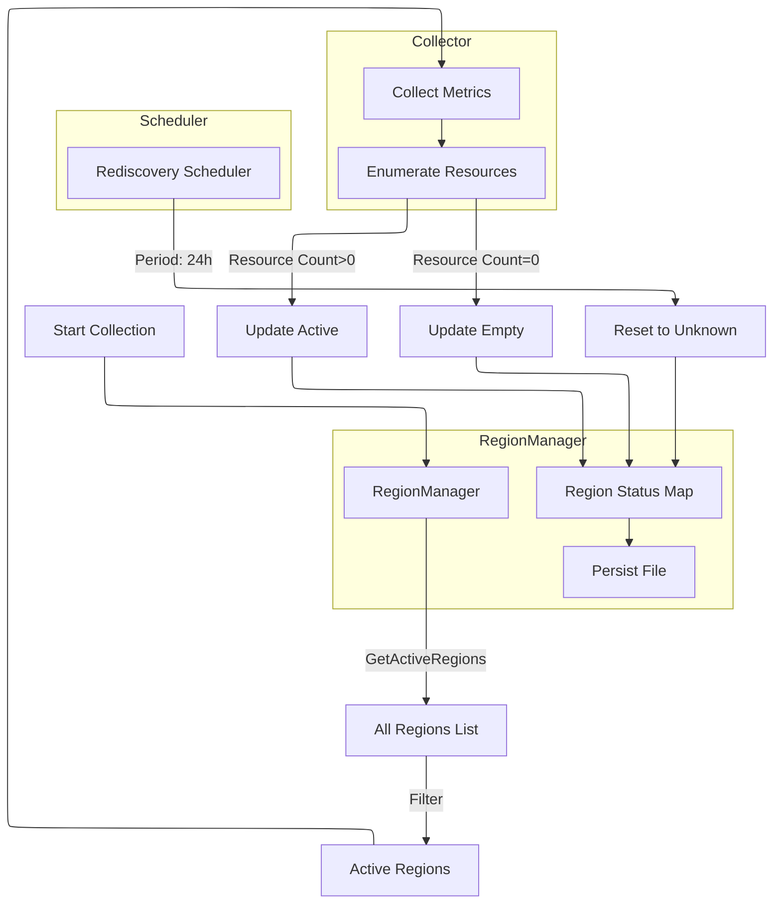

# multicloud-exporter 集群与并行架构设计

## 1. 云原生架构（Kubernetes）

### 1.1 架构图（Mermaid）


```mermaid
---
config:
  theme: mc
  layout: elk
---
graph LR
  subgraph Kubernetes_Cluster
    subgraph Deployment
      P1[Pod]
      P2[Pod]
      P3[Pod]
    end
    S[Service ClusterIP]
    HS[Headless Service]
    HPA[HPA]
    PROBES[Probes healthz metrics]
    AFF[Pod Anti-Affinity]
    SM[ServiceMonitor]
    PROM[Prometheus]

    Deployment --> S
    PROM -- scrape --> S
    SM -- discovery --> PROM
    HS --> Deployment
    HPA --> Deployment
    PROBES --> Deployment
    AFF --> Deployment
  end
```

### 1.2 关键点

- 副本与伸缩：`replicaCount` + `HPA`（CPU 70% 目标，`minReplicas`/`maxReplicas` 可调）。
- 服务发现与负载：`Service` 提供负载均衡；可选 `Headless Service` 提供 Pod IP 列表用于成员发现。
- 反亲和与调度优化：通过 `affinity`/`topologySpreadConstraints`（Chart 可配置）实现跨节点扩散。
- 健康检查：容器暴露 `GET /healthz`（存活探针）与 `GET /metrics`（就绪探针）。
- 指标采集与导出：使用 `ServiceMonitor` 或原生注解方式供 Prometheus 抓取。
- Period 自动适配：未显式配置时，采集器调用云侧元数据接口选择指标的最小可用 `Period`，以与 `server.scrape_interval` 保持一致；实现位置见 `internal/providers/tencent/tencent.go:136-197`，调用点 `internal/providers/tencent/clb.go:79-83`、`internal/providers/tencent/bwp.go:75-79`，阿里云参考 `internal/providers/aliyun/aliyun.go:561-615`。
- 智能区域发现：通过 `RegionManager` 接口管理区域状态，优先采集活跃区域，跳过连续为空的区域；实现位置 `internal/providers/common/region_manager.go:1-444`，配置项见 `configs/server.yaml:28-33`，指标定义见 `internal/metrics/metrics.go:71-95`。

### 1.3 Helm 关键配置

- `values.yaml`：
  - `replicaCount`: 副本数。
  - `hpa.enabled`, `hpa.minReplicas`, `hpa.maxReplicas`, `hpa.metrics`: 自动伸缩规则。
  - `probes.liveness`, `probes.readiness`: 健康探针。
  - `headless.enabled`, `headless.name`: 是否启用 Headless Service。
  - `cluster.discovery`: `headless` | `file` | 空；`cluster.svcName`/`cluster.file` 配合使用。

- 模板：
  - `templates/deployment.yaml` 支持 `replicaCount`、探针、Cluster 相关环境变量、Downward API 注入。
  - `templates/hpa.yaml`（启用时渲染）。
  - `templates/service.yaml` 提供对外服务与 Prometheus 抓取入口。
  - `templates/headless-service.yaml`（可选）为成员发现提供 Pod IP 解析。
  - `templates/servicemonitor.yaml`（如使用 Operator）。

### 1.4 实现步骤

- 设置 `replicaCount` 与资源请求，部署服务。
- 根据负载开启 `hpa.enabled` 并配置目标指标（CPU或自定义）。
- 如需成员分片，在 `values.yaml` 中设置：
  - `headless.enabled: true`，并将 `cluster.discovery: headless`，`cluster.svcName` 指向 headless 服务名。
- 如需强约束调度，配置 `affinity`/`topologySpreadConstraints`。
- 使用 `ServiceMonitor` 或在 `Service` 上配置抓取注解，完成 Prometheus 集成。
- 配置 Period 与采集频率：`server.scrape_interval` 推荐与云侧最小 `Period` 一致；Chart 文档与 README 已补充说明。

## 2. 传统宿主机并行架构

### 2.1 架构图（Mermaid）


```mermaid
---
config:
  theme: mc
  layout: elk
---
graph LR
  subgraph Hosts
    I0[Exporter instance 0]
    I1[Exporter instance 1]
    I2[Exporter instance 2]
    FILE[Shared members file]
    SHARD[Deterministic sharding fnv]
    HR[Hot-reload SIGHUP polling]
  end

  PROM[Prometheus]

  PROM -- scrape --> I0
  PROM -- scrape --> I1
  PROM -- scrape --> I2

  FILE --> I0
  FILE --> I1
  FILE --> I2

  SHARD --> I0
  SHARD --> I1
  SHARD --> I2

  HR --> I0
  HR --> I1
  HR --> I2
```

### 2.2 核心算法

- 成员发现（K8s/宿主机通用）：`internal/utils/sharding.go` 的 `ClusterConfig` 函数。
    - `headless`: 解析 `CLUSTER_SVC` DNS 获取 Pod IP 列表，匹配 `POD_IP` 得到 `(wTotal,wIndex)`。
    - `file`: 读取 `CLUSTER_FILE` 列表，与 `POD_NAME`/`HOSTNAME` 匹配计算 `(wTotal,wIndex)`。

  - 分片与路由：
  - 核心算法：集中于 `internal/utils/sharding.go`，提供 `ClusterConfig`（获取总分片数与当前索引）与 `ShouldProcess`（判断是否处理当前 Key）。
  - **三级分片机制**（v0.4.6+ 新增）：
    - **账号级分片**：由 `Collector` 在启动时检查云厂商是否支持内部分片，仅对不支持内部分片的云厂商使用产品级分片。
      - 实现位置：`internal/collector/collector.go:43-49`
      - Provider 接口方法：`SupportsInternalSharding() bool`
      - 判断逻辑：如果 `SupportsInternalSharding()` 返回 `true`，则使用云厂商内部分片（按资源）；否则使用产品级分片（按命名空间）
    - **区域级分片**：由各 Provider 在 `Collect` 方法中调用 `ShouldProcess(AccountID|Region)`，决定是否处理该区域。
    - **产品级分片**：由各 Provider 在产品采集循环中调用 `ShouldProcess(AccountID|Region|Namespace)`，决定是否处理该产品。
  - 分片键格式：
    - 区域级：`AccountID|Region`（例如：`acc-1|cn-hangzhou`）
    - 产品级：`AccountID|Region|Namespace`（例如：`acc-1|cn-hangzhou|acs_ecs_dashboard`）
  - 实现位置：
    - 账号级分片：`internal/collector/collector.go:43-49`、`internal/providers/registry.go`
    - 区域级分片：`internal/providers/aliyun/aliyun.go:161-164`、`internal/providers/tencent/tencent.go:56-60`
    - 产品级分片：`internal/providers/aliyun/aliyun.go:277-283`、`internal/providers/tencent/tencent.go:175-183`、`internal/providers/aws/lb.go:217-235`
  - 哈希函数：`ShardIndex` 在 `internal/utils/sharding.go`，使用 FNV-32a 算法。
  - **分片机制设计说明**：
    - 阿里云、腾讯云、华为云、AWS 均在 Provider 层实现了内部分片（按资源维度分片），因此这些云厂商不会使用账号级分片。
    - 账号级分片主要用于未来接入不支持内部分片的云厂商时，保证多副本环境下的分片正确性。
    - 产品级分片仅在云厂商不支持内部分片时启用，默认情况下不使用。

- 配置热更新：
  - K8s：使用 ConfigMap + `stakater/reloader` 注解已集成；Chart 已支持。
  - 宿主机：SIGHUP 信号触发配置重载，或定时轮询文件更新时间（推荐 15–60s）。

### 2.3 关键环境变量

- `CLUSTER_DISCOVERY`: `headless`/`file`/空。
- `CLUSTER_SVC`: 成员服务名（headless）。
- `CLUSTER_FILE`: 成员列表文件路径（file）。
- `CLUSTER_WORKERS`/`CLUSTER_INDEX`: 静态分片参数回退。

## 3. 通用要求实现

### 3.1 监控指标

- 采集成效与性能：
  - `collection_duration_seconds` 在 `cmd/multicloud-exporter/main.go:128` 统计周期时长。
  - `request_total` 与 `request_duration_seconds` 在各 provider 中记录云 API 成功/失败与耗时。
  - `rate_limit_total` 统计限流触发次数。
  - 资源指标：统一暴露在 `metrics.NamespaceMetric`/`metrics.ResourceMetric`，示例见 `internal/metrics/*`。
- 统一命名与映射：通过 `configs/mappings/*.yaml` 与别名函数保持跨云一致（如 ALB/BWP/CBWP/CLB/COS/NLB/GWLB/OSS）；Aliyun SLB 别名函数见 `internal/metrics/aliyun/slb.go:22-46`，Tencent CLB 别名注册见 `internal/metrics/tencent/clb.go:9-32`，BWP 前缀注册见 `internal/metrics/tencent/bwp.go:9-18`。

### 3.2 自动化部署

- Kubernetes：
  - 安装：`helm install mce ./chart -f values.yaml`。
  - 副本与伸缩：设置 `replicaCount`，或启用 `hpa.enabled`。
  - 成员发现：`headless.enabled: true`；`cluster.discovery: headless`；`cluster.svcName: <svc-name>`。
  - 健康检查：`probes.liveness/readiness` 默认启用。
  - 认证与安全：`server.admin_auth_enabled` 启用管理接口 BasicAuth；通过 Ingress/ServiceMesh 终止 TLS；云 SDK 强制 HTTPS。

- 宿主机：
  - Systemd 单元示例：
    ```
    [Unit]
    Description=multicloud-exporter
    After=network.target

    [Service]
    ExecStart=/usr/local/bin/multicloud-exporter
    Environment="SERVER_PATH=/etc/mce/server.yaml"
    Environment="CLUSTER_DISCOVERY=file"
    Environment="CLUSTER_FILE=/var/run/mce/members.txt"
    Restart=always

    [Install]
    WantedBy=multi-user.target
    ```
  - Prometheus `static_configs` 指向各实例 `:9101`。

### 3.3 高可用与故障转移

- K8s：Deployment 多副本 + HPA；探针失败自动重启；Pod 反亲和减少同机失败概率；Prometheus 多 target 抓取容错。
- 宿主机：多实例并行；外部维护成员列表文件（自动化运维工具更新）；分片哈希稳定，实例宕机后剩余实例仍覆盖其分片（通过总成员变化重算）。

### 3.4 性能指标与目标

- 采集周期建议与云 API Period 匹配（详见 README）。
- 并发控制：
  - 区域并发：`server.region_concurrency`；
  - 产品并发：`server.product_concurrency`（默认 2，控制同一地域内不同命名空间的并行度）；
  - 指标并发：`server.metric_concurrency`（默认 5，控制同一命名空间下多个指标批次的并行度）。

## 4. 故障排查指南

### 4.1 指标丢失问题

**症状**：Prometheus 中某些指标没有数据或数据不连续。

**排查步骤**：

1. **检查采集状态**：
   ```bash
   curl http://localhost:9101/api/discovery/status
   ```
   查看各账号的采集状态和最后完成时间。

2. **检查日志**：
   ```bash
   kubectl logs -f deployment/multicloud-exporter | grep -i error
   ```
   关注以下错误：
   - `auth_error`：认证失败，检查 AccessKey 配置
   - `limit_error`：API 限流，检查 `multicloud_rate_limit_total` 指标
   - `region_skip`：区域不支持，检查账号的区域权限

3. **检查资源权限**：
   - 确认账号配置中的 `resources` 字段包含要采集的资源类型
   - 检查云厂商控制台中的资源是否存在

4. **检查 Period 配置**：
   - 确认 `server.scrape_interval` 与云 API 的 `Period` 匹配
   - 如果 `scrape_interval > Period`，会导致数据丢失（详见 README）

5. **检查分片配置**：
   - 在集群模式下，确认资源是否被正确分片
   - 检查 `CLUSTER_WORKERS` 和 `CLUSTER_INDEX` 配置

### 4.2 API 限流问题

**症状**：日志中出现大量 `limit_error`，采集速度变慢。

**排查步骤**：

1. **查看限流统计**：
   ```bash
   curl http://localhost:9101/metrics | grep multicloud_rate_limit_total
   ```
   查看各云厂商和 API 的限流次数。

2. **检查并发配置**：
   - 降低 `server.region_concurrency`（默认 3）
   - 降低 `server.product_concurrency`（默认 2）
   - 降低 `server.metric_concurrency`（默认 5）

3. **检查采集频率**：
   - 增加 `server.scrape_interval`，减少 API 调用频率
   - 增加 `server.discovery_ttl`，减少资源发现频率

4. **检查缓存配置**：
   - 确认 `server.discovery_ttl` 设置合理（建议 ≥ 1h）
   - 查看 `multicloud_cache_entries_total` 指标，确认缓存生效

### 4.3 内存增长问题

**症状**：Pod 内存使用持续增长，可能触发 OOM。

**排查步骤**：

1. **查看缓存指标**：
   ```bash
   curl http://localhost:9101/metrics | grep multicloud_cache
   ```
   关注 `multicloud_cache_size_bytes` 和 `multicloud_cache_entries_total`。

2. **检查缓存 TTL**：
   - 确认 `server.discovery_ttl` 设置合理
   - 如果资源数量很大，考虑缩短 TTL 或增加 Pod 内存限制

3. **检查资源数量**：
   - 确认账号中的资源数量是否异常增长
   - 检查是否有资源泄漏（已删除的资源仍在缓存中）

4. **调整资源配置**：
   ```yaml
   resources:
     limits:
       memory: "512Mi"
     requests:
       memory: "256Mi"
   ```

### 4.4 采集超时问题

**症状**：采集任务长时间未完成，日志中出现超时错误。

**排查步骤**：

1. **检查网络连接**：
   - 确认 Pod 可以访问云厂商 API 端点
   - 检查防火墙和网络策略

2. **检查 API 响应时间**：
   ```bash
   curl http://localhost:9101/metrics | grep multicloud_request_duration_seconds
   ```
   查看各 API 的响应时间，如果持续很高，可能是网络问题。

3. **调整超时配置**：
   - 如果网络较慢，可以增加 HTTP 客户端超时时间
   - 检查云厂商 API 的服务状态

4. **检查并发配置**：
   - 降低并发数，避免过多并发请求导致超时
   - 检查云厂商的 API 限流策略

## 5. 性能调优建议

### 5.1 并发参数调优

**区域并发（region_concurrency）**：
- **默认值**：3
- **调优建议**：
  - 账号区域数量少（< 5）：可以增加到 5-10
  - 账号区域数量多（> 10）：保持默认或降低到 2
  - 如果遇到限流，降低到 1-2

**产品并发（product_concurrency）**：
- **默认值**：2
- **调优建议**：
  - 命名空间数量少（< 3）：可以增加到 3-5
  - 命名空间数量多（> 5）：保持默认或降低到 1
  - 如果遇到限流，降低到 1

**指标并发（metric_concurrency）**：
- **默认值**：5
- **调优建议**：
  - 指标数量少（< 10）：可以增加到 10-20
  - 指标数量多（> 50）：保持默认或降低到 3
  - 如果遇到限流，降低到 1-2

### 5.2 TTL 调优

**发现 TTL（discovery_ttl）**：
- **默认值**：1h
- **调优建议**：
  - 资源变化频繁：缩短到 30m
  - 资源变化不频繁：延长到 2h-4h
  - 如果遇到限流，延长到 4h-8h

**缓存 TTL**：
- 资源 ID 缓存：与 `discovery_ttl` 一致
- 元数据缓存：由各 Provider 内部管理，通常为 1h

### 5.3 采集频率调优

**Scrape Interval**：
- **默认值**：60s
- **调优建议**：
  - 关键指标：与云 API 的 `Period` 匹配（通常为 60s）
  - 非关键指标：可以设置为 300s（5分钟）以节省 API 调用
  - 注意：如果 `scrape_interval > Period`，会导致数据丢失

**Period 自动适配**：
- Exporter 会自动从云侧元数据选择指标的最小可用 `Period`
- 如果云 API 支持多个 Period，优先选择与 `scrape_interval` 最接近的值
- 如果元数据不可用，使用 `server.period_fallback`（默认 60s）

### 5.4 资源限制调优

**内存限制**：
- **建议值**：
  - 小规模（< 100 资源）：256Mi
  - 中规模（100-1000 资源）：512Mi
  - 大规模（> 1000 资源）：1Gi-2Gi

**CPU 限制**：
- **建议值**：
  - 小规模：100m-200m
  - 中规模：200m-500m
  - 大规模：500m-1000m

### 5.5 监控指标调优

**关键指标**：
- `multicloud_collection_duration_seconds`：采集周期耗时
- `multicloud_request_total`：API 调用总数（按状态分类）
- `multicloud_rate_limit_total`：限流次数
- `multicloud_cache_size_bytes`：缓存大小
- `multicloud_cache_entries_total`：缓存条目数
- `multicloud_region_status_total`：区域状态统计（active/empty/unknown）
- `multicloud_region_discovery_duration_seconds`：区域发现耗时
- `multicloud_region_skip_total`：跳过的空区域次数

**告警规则建议**：
- 采集耗时 > 5 分钟：可能存在问题
- 限流次数持续增长：需要降低并发或增加采集间隔
- 缓存大小持续增长：可能需要调整 TTL 或增加内存限制
  - 产品并发：`server.product_concurrency`；
  - 指标并发：`server.metric_concurrency`；
  - 最终目标：P95 周期完成时间 ≤ 周期时长的 0.6；错误率 ≤ 0.1%。
  - 基准与压力：CI 执行 `go test -bench . -benchmem -run ^$ ./...` 与并行压力 `go test -race -run . -parallel 16 ./...`，收集 `benchmem` 指标并观察限流错误。

### 3.5 平滑升级与回滚

- K8s：RollingUpdate（`maxUnavailable=0` 推荐）；保留旧版本镜像；Chart 版本化。
- 宿主机：逐台滚动，利用系统级负载均衡与 Prometheus 抓取冗余避免可见中断；可在灰度窗口观察核心指标。

## 4. 关键实现引用

- `cmd/multicloud-exporter/main.go:137` 注册 `/metrics`；`cmd/multicloud-exporter/main.go:137`–`179` 周期采集与事件流接口；`cmd/multicloud-exporter/main.go:137` 新增 `/healthz`。
- `internal/collector/collector.go:103` 成员发现；`internal/collector/collector.go:182` 账号分片；`internal/collector/collector.go:173` 哈希函数。
- `internal/providers/aliyun/aliyun.go:119` 区域分片；`internal/providers/tencent/tencent.go:52` 区域分片。
- `chart/templates/deployment.yaml`、`chart/templates/hpa.yaml`、`chart/templates/headless-service.yaml`：部署、伸缩与成员发现支持。

## 5. 配置参数总览（Helm）

- `replicaCount`
- `hpa.enabled`, `hpa.minReplicas`, `hpa.maxReplicas`, `hpa.metrics`
- `probes.liveness.*`, `probes.readiness.*`
- `headless.enabled`, `headless.name`
- `cluster.discovery`, `cluster.svcName`, `cluster.file`
- `server.*`（采集并发、日志、周期）

 ## 6. 集群同步机制（v0.4.6+）

 ### 6.1 架构设计

 集群同步机制通过 HTTP API 在多副本之间同步区域状态，确保各 Pod 对活跃区域的认识一致，避免重复采集或漏采。

 ### 6.2 数据流图

 ```mermaid
 ---
 config:
   theme: mc
   layout: elk
 ---
 graph LR
   subgraph Pod1["Pod 1"]
     RM1[RegionManager]
     SM1[SyncManager]
   end
   
   subgraph Pod2["Pod 2"]
     RM2[RegionManager]
     SM2[SyncManager]
   end
   
   subgraph Pod3["Pod 3"]
     RM3[RegionManager]
     SM3[SyncManager]
   end
   
   RM1 -->|UpdateStatus| RM1
   RM1 -->|Broadcast| SM1
   SM1 -->|HTTP POST /api/v1/cluster/sync| SM2
   SM1 -->|HTTP POST /api/v1/cluster/sync| SM3
   SM2 -->|UpdateLocal| RM2
   SM3 -->|UpdateLocal| RM3
 ```

 ### 6.3 同步流程

 1. **状态更新**：某 Pod 采集完某个区域后，调用 `RegionManager.UpdateRegionStatus()` 更新本地状态
 2. **广播请求**：`RegionManager` 调用 `SyncManager.BroadcastRegionStatus()` 将状态广播给所有对等节点
 3. **超时控制**：每次 HTTP 请求设置 5 秒超时，避免长时间阻塞
 4. **重试机制**：每次广播最多重试 3 次，使用指数退避策略（初始 200ms，最大 1s）
 5. **失败记录**：如果 3 次重试均失败，记录警告日志并更新 `multicloud_region_sync_failure_total` 指标
 6. **异步执行**：所有对等节点的广播请求并发执行，不阻塞主采集流程

 ### 6.4 实现位置

 - **广播实现**：`internal/cluster/manager.go:62-123`
 - **接收处理**：`cmd/multicloud-exporter/main.go` 中注册 `/api/v1/cluster/sync` 接口
 - **调用点**：`internal/providers/common/region_manager.go:236`

 ### 6.5 关键参数

 | 参数 | 说明 | 默认值 | 配置位置 |
 |------|------|--------|----------|
 | 超时时间 | 每次广播请求的超时时间 | 5s | 代码硬编码（`internal/cluster/manager.go:93`） |
 | 最大重试次数 | 每次对等节点广播的最大重试次数 | 3 | 代码硬编码（`internal/cluster/manager.go:89`） |
 | 初始延迟 | 重试的初始延迟时间 | 200ms | 代码硬编码（`internal/cluster/manager.go:113`） |
 | 最大延迟 | 重试的最大延迟时间 | 1s | 代码硬编码（`internal/cluster/manager.go:114`） |

 ### 7.6 监控指标

 - `multicloud_region_sync_failure_total{cloud_provider}`：集群同步失败次数（按云厂商分类）

 ### 6.7 容错与优化

 **容错机制**：
 - 超时控制：避免因网络故障或对等节点响应慢导致采集阻塞
 - 重试机制：在网络抖动时提高广播成功率
 - 异步执行：不影响主采集流程，即使广播失败也能正常采集

 **优化策略**：
 - 指数退避：避免频繁重试加剧网络压力
 - 并发广播：同时向所有对等节点发送，减少总延迟
 - 失败指标：提供可观测性，便于及时发现同步问题

 ## 7. 智能区域发现机制

 ### 7.1 架构设计

智能区域发现通过管理区域状态，智能选择有资源的区域进行采集，避免重复访问空区域，显著提升采集性能。

### 6.2 数据流图


```mermaid
---
config:
  theme: mc
  layout: elk
---
graph TB
  subgraph RegionManager["RegionManager"]
    RM[RegionManager]
    STATUS[Region Status Map]
    PERSIST[Persist File]
  end
  
  subgraph Collector["Collector"]
    COLLECT[Collect Metrics]
    ENUM[Enumerate Resources]
  end
  
  START[Start Collection] --> RM
  RM -->|GetActiveRegions| ALL[All Regions List]
  ALL -->|Filter| ACTIVE[Active Regions]
  ACTIVE --> COLLECT
  COLLECT --> ENUM
  ENUM -->|Resource Count>0| UPDATE1[Update Active]
  ENUM -->|Resource Count=0| UPDATE2[Update Empty]
  UPDATE1 --> STATUS
  UPDATE2 --> STATUS
  STATUS --> PERSIST
  
  subgraph Scheduler["Scheduler"]
    SCHED[Rediscovery Scheduler]
  end
  
  SCHED -->|Period: 24h| RESET[Reset to Unknown]
  RESET --> STATUS
```

 ### 7.3 区域状态定义

| 状态 | 说明 | 行为 |
|------|------|------|
| `unknown` | 未知，首次运行或重新发现 | 采集时检查该区域 |
| `active` | 有资源，最近发现到资源 | 优先采集 |
| `empty` | 无资源，连续 N 次为空 | 达到阈值后跳过采集 |

 ### 7.4 工作流程

1. **初始化**：
   - 从持久化文件加载区域状态（如果存在）
   - 初始化区域状态映射表

2. **区域选择**：
   - 调用 `GetActiveRegions(accountID, allRegions)`
   - 优先返回 `active` 状态的区域
   - 跳过 `empty` 状态且达到阈值的区域
   - 包含 `unknown` 状态的区域

3. **状态更新**：
   - 采集后调用 `UpdateRegionStatus(accountID, region, count, status)`
   - 资源数量 > 0：标记为 `active`，更新最后活跃时间
   - 资源数量 = 0：标记为 `empty`，累加连续为空次数

4. **持久化**：
   - 周期性保存区域状态到 JSON 文件
   - 重启后可快速恢复，避免重复探测

5. **重新发现**：
   - 定期调度器（默认 24 小时）执行
   - 将所有区域重置为 `unknown`
   - 下一轮采集时重新探测资源

 ### 7.5 配置项

| 配置项 | 说明 | 默认值 | 环境变量 |
|--------|------|--------|----------|
| `enabled` | 是否启用智能区域发现 | `true` | `REGION_DISCOVERY_ENABLED` |
| `discovery_interval` | 重新发现周期 | `24h` | `REGION_DISCOVERY_INTERVAL` |
| `empty_threshold` | 空区域跳过阈值（连续次数） | `3` | `REGION_EMPTY_THRESHOLD` |
| `persist_file` | 持久化文件路径 | `./data/region_status.json` | `REGION_PERSIST_FILE` |

### 6.6 监控指标

- `multicloud_region_status_total{cloud_provider, status}`：区域状态统计
- `multicloud_region_discovery_duration_seconds{cloud_provider}`：区域发现耗时
- `multicloud_region_skip_total{cloud_provider}`：跳过的空区域次数

 ### 7.7 性能收益

**典型场景**（阿里云 20 个区域，仅 3 个区域有资源）：
- **API 调用减少**：减少约 85% 的区域枚举 API 调用
- **采集延迟降低**：采集周期从 60 秒降低到约 15 秒
- **云配额节省**：显著降低云厂商 API 配额消耗

  ## 8. 产品级区域状态隔离（v0.4.8+）

  ### 8.1 架构设计

  产品级区域状态隔离通过为每个云产品创建独立的 RegionManager，实现产品级别的区域状态管理，避免不同产品间的状态干扰。

  ### 8.2 设计背景

  **问题背景**：
  - 旧版本使用单个共享的 RegionManager 管理所有产品的区域状态
  - 不同产品的区域状态可能相互干扰
  - 例如：SLB 某个区域为空，但 CBWP 同一区域有资源，共享状态导致判断复杂
  - 集群同步时无法区分产品的区域状态

  **解决方案**：
  - 为每个产品创建独立的 RegionManager 实例
  - 每个产品的区域状态完全隔离，互不干扰
  - 集群同步时携带产品标识，实现产品级别的状态同步

  ### 8.3 架构图

  ```mermaid
  ---
  config:
    theme: mc
    layout: tb
  ---
  graph TB
    subgraph Aliyun["阿里云 Collector"]
      subgraph CBWP["CBWP 产品"]
        RM1[RegionManager<br/>product=cbwp]
        STATUS1[Region Status Map]
      end
      
      subgraph SLB["SLB 产品"]
        RM2[RegionManager<br/>product=slb]
        STATUS2[Region Status Map]
      end
      
      subgraph OSS["OSS 产品"]
        RM3[RegionManager<br/>product=oss]
        STATUS3[Region Status Map]
      end
    end
    
    subgraph SyncManager["集群同步管理器"]
      SYNC[SyncManager]
      BROADCAST[广播器]
    end
    
    RM1 -->|1. 更新区域状态| STATUS1
    RM2 -->|1. 更新区域状态| STATUS2
    RM3 -->|1. 更新区域状态| STATUS3
    
    STATUS1 -->|2. 产品级广播| BROADCAST
    STATUS2 -->|2. 产品级广播| BROADCAST
    STATUS3 -->|2. 产品级广播| BROADCAST
    
    BROADCAST -->|3. 集群同步| SYNC
    SYNC -->|4. 同步到对等节点| RM1
    SYNC -->|4. 同步到对等节点| RM2
    SYNC -->|4. 同步到对等节点| RM3
    
    style Aliyun fill:#e1f5ff,stroke:#333
    style SyncManager fill:#ffe1f5,stroke:#333
  ```

  ### 8.4 产品标识映射

  | 云厂商 | 产品 ID | Namespace | 产品名称 |
  |--------|---------|-----------|---------|
  | 阿里云 | slb | acs_slb_dashboard | 传统负载均衡 |
  | 阿里云 | cbwp | ACS_CBP | 共享带宽包 |
  | 阿里云 | oss | acs_oss_dashboard | 对象存储 |
  | 阿里云 | alb | acs_alb_dashboard | 应用负载均衡 |
  | 阿里云 | nlb | acs_nlb_dashboard | 网络负载均衡 |
  | 阿里云 | gwlb | acs_gwlb_dashboard | 网关负载均衡 |
  | 腾讯云 | clb | QCE/LB_PUBLIC | 云负载均衡 |
  | 腾讯云 | bwp | QCE/CDN_BWP | 共享带宽包 |
  | 腾讯云 | cos | QCE/COS_DATA | 云对象存储 |
  | 腾讯云 | gwlb | QCE/GWLB | 网关负载均衡 |
  | 华为云 | elb | SYS.ELB | 弹性负载均衡 |
  | 华为云 | obs | SYS.OBS | 对象存储服务 |
  | AWS | lb | AWS/ELB | 弹性负载均衡 |
  | AWS | s3 | AWS/S3 | 简单存储服务 |

  ### 8.5 工作流程

  #### 8.5.1 初始化阶段

  1. **Collector 启动时**：
     - 遍历配置的产品列表
     - 为每个产品创建独立的 RegionManager 实例
     - 设置产品标识（provider, product）
     - 注册到集群同步管理器

  2. **示例代码**（阿里云）：
     ```go
     // internal/providers/aliyun/aliyun.go
     func NewCollector(...) *Collector {
         c := &Collector{
             productRegionManagers: make(map[string]common.RegionManager),
         }
         
         // 为每个产品创建独立的 RegionManager
         for _, product := range []string{AliyunProductSLB, AliyunProductCBWP, AliyunProductOSS} {
             rm := common.NewSmartRegionManager(common.RegionDiscoveryConfig{
                 Enabled: cfg.GetServer().RegionDiscovery.Enabled,
             })
             
             // 设置产品标识
             rm.SetProductIdentifier("aliyun", product)
             
             // 注册到集群同步管理器
             if clusterMgr != nil {
                 clusterMgr.RegisterRegionManager("aliyun", product, rm)
                 rm.SetBroadcaster(clusterMgr, "aliyun", product)
             }
             
             c.productRegionManagers[product] = rm
         }
         
         return c
     }
     ```

  #### 8.5.2 采集阶段

  1. **获取产品的 RegionManager**：
     ```go
     func (a *Collector) listSLBIDs(...) ([]string, error) {
         rm := a.getProductRegionManager(AliyunProductSLB)
         
         // 检查是否应该跳过该区域
         if rm.ShouldSkipRegion(account.AccountID, region) {
             logger.Info("skip empty region", 
                 zap.String("product", AliyunProductSLB),
                 zap.String("region", region))
             return []string{}, nil
         }
         
         // 执行实际的 API 调用
         ids, err := a.client.DescribeLoadBalancers(...)
         
         // 更新区域状态
         status := common.RegionStatusActive
         if len(ids) == 0 {
             status = common.RegionStatusEmpty
         }
         rm.UpdateRegionStatus(account.AccountID, region, len(ids), status)
         
         return ids, err
     }
     ```

  2. **产品级别的区域状态管理**：
     - 每个产品的 RegionManager 独立维护区域状态
     - 产品的空区域不会影响其他产品的区域状态
     - 每个产品独立跳过空区域，优化采集效率

  #### 8.5.3 集群同步阶段

  1. **产品级广播**：
     - 每个产品的 RegionManager 独立广播自己的区域状态
     - 广播消息携带产品标识：`{provider}:{product}`
     - 对等节点根据产品标识路由到对应的 RegionManager

  2. **示例消息格式**：
     ```json
     {
       "provider": "aliyun",
       "product": "slb",
       "account_id": "1234567890123456",
       "region": "cn-hangzhou",
       "status": "active",
       "resource_count": 5,
       "timestamp": "2026-01-20T10:00:00Z"
     }
     ```

  3. **接收端处理**：
     ```go
     // internal/cluster/manager.go
     func (sm *SyncManager) HandleSync(msg RegionStatusUpdate) {
         // 根据产品标识查找对应的 RegionManager
         key := fmt.Sprintf("%s:%s", msg.Provider, msg.Product)
         rm := sm.managers[key]
         
         if rm != nil {
             // 更新到对应产品的 RegionManager
             rm.UpdateFromPeer(msg)
         }
     }
     ```

  ### 8.6 性能收益

  **典型场景**（阿里云 20 个区域，6 个产品）：
  - **采集优化**：
    - 每个产品独立跳过空区域，减少无效 API 调用
    - 例如：SLB 在 10 个区域为空，CBWP 在 5 个区域为空
    - 总计减少约 75% 的空区域 API 调用

  - **集群同步优化**：
    - 产品级状态隔离，避免全局广播
    - 广播消息更精准，减少网络流量

  - **内存占用**：
    - 每个产品的 RegionManager 独立管理内存
    - 内存占用 = 产品数量 × 区域数量 × 128 字节
    - 6 个产品 × 20 区域 × 128 字节 ≈ 15 KB

  ### 8.7 配置项

  产品级状态隔离无需额外配置，自动启用。

  **相关配置**：
  - `server.region_discovery.enabled`: 是否启用智能区域发现（默认 true）
  - `server.region_discovery.empty_threshold`: 空区域跳过阈值（默认 3）

  ### 8.8 监控指标

  产品级状态隔离提供了以下 Prometheus 指标：

  **区域状态指标**（扩展了 `product` 标签）：
  - `multicloud_region_status_total{cloud_provider, product, status}`: 区域状态统计
  - `multicloud_region_skip_total{cloud_provider, product}`: 跳过的空区域次数

  **内存监控指标**（新增）：
  - `multicloud_region_manager_memory_bytes{cloud_provider, product}`: RegionManager 内存占用（字节）
  - `multicloud_region_manager_products_total{cloud_provider}`: 每个云厂商的 RegionManager 数量

  **使用示例**：
  ```promql
  # 查询阿里云 SLB 的活跃区域数
  multicloud_region_status_total{cloud_provider="aliyun", product="slb", status="active"}

  # 查询所有产品的内存占用
  multicloud_region_manager_memory_bytes

  # 查询每个云厂商的 RegionManager 数量
  multicloud_region_manager_products_total
  ```

  ### 8.9 故障排查

  **问题 1：某些产品的指标没有采集到**

  **可能原因**：
  - 产品的 RegionManager 将所有区域标记为 `empty`，跳过了采集

  **排查步骤**：
  ```bash
  # 1. 检查该产品的区域状态
  curl -s http://localhost:9101/metrics | grep multicloud_region_status_total | grep product="slb"

  # 2. 检查跳过次数
  curl -s http://localhost:9101/metrics | grep multicloud_region_skip_total | grep product="slb"

  # 3. 检查日志中的区域状态更新
  kubectl logs -f deployment/multicloud-exporter | grep "UpdateRegionStatus"
  ```

  **解决方案**：
  - 降低 `server.region_discovery.empty_threshold`（如从 3 改为 5）
  - 增加 `server.region_discovery.discovery_interval`（如从 24h 改为 12h），更频繁地重新发现

  **问题 2：集群同步后某些产品的区域状态不一致**

  **可能原因**：
  - 集群同步键格式错误，导致路由到错误的 RegionManager

  **排查步骤**：
  ```bash
  # 1. 检查集群同步失败次数
  curl -s http://localhost:9101/metrics | grep multicloud_broadcast_failed_total

  # 2. 检查各 Pod 的产品区域状态
  for pod in $(kubectl get pods -l app.kubernetes.io/name=multicloud-exporter -o name); do
     kubectl exec $pod -- cat /app/data/region_status.json | jq .
  done
  ```

  **解决方案**：
  - 检查日志中的广播消息格式
  - 验证产品标识是否正确（小写，如 slb 而非 SLB）
  - 重启 Pod，重新建立集群同步

  **问题 3：内存占用持续增长**

  **可能原因**：
  - 某个产品的 RegionManager 累积了大量区域数据

  **排查步骤**：
  ```bash
  # 1. 检查各产品的内存占用
  curl -s http://localhost:9101/metrics | grep multicloud_region_manager_memory_bytes

  # 2. 检查是否超过告警阈值（默认 5 MB/产品）
  ```

  **解决方案**：
  - 检查该产品的区域数量是否异常
  - 增加该产品的 `empty_threshold`，更快跳过空区域
  - 考虑清理不使用的区域配置

  ## 9. 缓存策略（v0.4.6+）

  ### 9.1 架构设计

  系统采用多层缓存策略，减少云 API 调用次数，提升采集性能。

  ### 9.2 缓存类型

 | 缓存类型 | 缓存内容 | TTL | 清理机制 | 实现位置 |
 |----------|----------|-----|----------|----------|
 | **资源 ID 缓存** | 资源 ID 列表（如 LB ID、Bucket ID） | 由 `discovery_ttl` 配置控制（默认 1h） | TTL 过期自动清理 | `internal/providers/aliyun/aliyun.go:1423-1433` |
 | **标签缓存** | 资源标签（如 `code_name`） | 由 `tag_cache_ttl` 配置控制（默认 30m） | TTL 过期自动清理 | `internal/providers/aliyun/aliyun.go:196-244` |
 | **元数据缓存** | 指标元数据（Period、Dimensions 等） | 1h（代码固定） | TTL 过期自动清理 | 各 Provider 内部实现 |
 | **区域状态缓存** | 区域活跃状态（active/empty/unknown） | 持久化到内存，重启后加载 | 定期重置（默认 24h） | `internal/providers/common/region_manager.go` |

 ### 8.3 空结果缓存策略（v0.4.6+ 新增）

 **问题背景**：
 - 云 API 临时故障或限流时，资源枚举返回空列表
 - 如果缓存空结果，会导致资源永久不可见，直到缓存过期

 **解决方案**：
 - **不缓存空结果**：在 `setCachedIDs` 方法中，如果资源列表为空，直接返回，不写入缓存
 - **下次重试**：下次采集时会重新调用云 API，提高资源可见性

 **实现位置**：
 - 阿里云：`internal/providers/aliyun/aliyun.go:1423-1429`
 - 腾讯云、华为云、AWS：类似实现

 **示例代码**：
 ```go
 func (a *Collector) setCachedIDs(account config.CloudAccount, region, namespace, rtype string, ids []string, meta map[string]interface{}) {
     // 不缓存空结果，避免 API 临时故障导致资源永久不可见
     if len(ids) == 0 {
         ctxLog := logger.NewContextLogger("Aliyun", "account_id", account.AccountID, "region", region, "namespace", namespace, "rtype", rtype)
         ctxLog.Debugf("资源列表为空，跳过缓存（允许下次重新尝试）")
         return
     }
     a.cacheMu.Lock()
     a.resCache[a.cacheKey(account, region, namespace, rtype)] = resCacheEntry{IDs: ids, Meta: meta, UpdatedAt: time.Now()}
     a.cacheMu.Unlock()
 }
 ```

 **优势**：
 - 避免 API 临时故障导致资源永久不可见
 - 提高系统容错性
 - 不影响正常场景的性能（空结果场景较少）

 ### 8.4 标签缓存 TTL 机制（v0.4.6+ 新增）

 **问题背景**：
 - 标签缓存键为 `accountID:region:rtype`，长期运行后会积累大量无用标签数据
 - 资源删除后，标签缓存不会自动清理，导致内存持续增长

 **解决方案**：
 - **TTL 过期机制**：为每个标签缓存条目设置过期时间（`ExpiresAt`）
 - **惰性清理**：在读取缓存时检查是否过期，过期则删除并重新获取
 - **配置项**：`server.tag_cache_ttl`（默认 30 分钟）

 **实现位置**：
 - 阿里云：`internal/providers/aliyun/aliyun.go:64-84, 196-244`

 **示例代码**：
 ```go
 type tagCacheEntry struct {
     Tags      map[string]string
     ExpiresAt time.Time
 }

 // 读取缓存时检查过期
 a.tagMu.RLock()
 if entry, ok := a.tagCache[cacheKey]; ok {
     a.tagMu.RUnlock()
     // 检查是否过期
     if time.Now().Before(entry.ExpiresAt) {
         return entry.Tags  // 缓存命中，未过期
     }
     logger.Debugf("标签缓存已过期，将重新获取")
 }
 a.tagMu.RUnlock()

 // 写入缓存时设置过期时间
 a.tagCache[cacheKey] = tagCacheEntry{
     Tags:      tags,
     ExpiresAt: time.Now().Add(tagCacheTTL),
 }
 ```

 **优势**：
 - 避免内存泄漏，长期运行后内存稳定
 - 减少无效的 VPC API 调用
 - 可通过配置调整 TTL，平衡性能和内存使用

 **待优化**（待办任务）：
 - 在资源枚举失败时，主动清理相关标签缓存（目前未实现）
 - 添加缓存大小监控指标（已实现部分）

 ### 8.5 缓存命中/未命中监控指标（v0.4.6+ 待实现）

 **目标**：添加缓存命中率和未命中率的监控指标，便于观察缓存效果。

 **建议指标**：
 - `multicloud_cache_hit_total{cache_type, cloud_provider, account_id, region, resource_type}`：缓存命中次数
 - `multicloud_cache_miss_total{cache_type, cloud_provider, account_id, region, resource_type}`：缓存未命中次数
 - `multicloud_cache_hit_ratio{cache_type}`：缓存命中率（Gauge）

 **缓存类型（cache_type）**：
 - `resource_id`：资源 ID 缓存
 - `tag`：标签缓存
 - `metadata`：元数据缓存

 **实现位置**：
 - 在 `getCachedIDs` 和 `setCachedIDs` 方法中添加指标记录
 - 在 `getTags` 方法中添加指标记录
 - 在 `getMetricMeta` 方法中添加指标记录

 **示例代码**：
 ```go
 func (a *Collector) getCachedIDs(...) ([]string, map[string]interface{}, bool) {
     a.cacheMu.RLock()
     entry, ok := a.resCache[key]
     a.cacheMu.RUnlock()
     
     if ok {
         // 记录缓存命中
         metrics.CacheHitTotal.WithLabelValues("resource_id", "aliyun", account.AccountID, region, rtype).Inc()
         return entry.IDs, entry.Meta, true
     }
     
     // 记录缓存未命中
     metrics.CacheMissTotal.WithLabelValues("resource_id", "aliyun", account.AccountID, region, rtype).Inc()
     return nil, nil, false
 }
 ```

 ### 8.6 资源枚举失败时清理标签缓存（v0.4.6+ 待实现）

 **目标**：当资源枚举失败（如 API 错误、网络故障）时，主动清理相关标签缓存，避免使用过期的标签数据。

 **实现方案**：

 1. **在枚举失败时清理缓存**：
    ```go
    func (a *Collector) listALBIDs(...) ([]string, map[string]interface{}, error) {
        ids, err := client.DescribeLoadBalancers(...)
        if err != nil {
            // 清理相关标签缓存
            a.clearTagCache(account.AccountID, region, "alb")
            return nil, nil, err
        }
        return ids, nil, nil
    }
    ```

 2. **添加清理方法**：
    ```go
    func (a *Collector) clearTagCache(accountID, region, rtype string) {
        prefix := accountID + ":" + region + ":"
        a.tagMu.Lock()
        defer a.tagMu.Unlock()
        for key := range a.tagCache {
            if strings.HasPrefix(key, prefix) {
                delete(a.tagCache, key)
            }
        }
        logger.Debugf("清理标签缓存，前缀=%s", prefix)
    }
    ```

 **优势**：
 - 避免使用过期的标签数据
 - 提高数据准确性
 - 减少无效的标签缓存占用内存

 ## 9. 实施清单

- 部署前校验：`helm lint chart/`；`go build`；`go vet`。
- 监控接入：配置 `ServiceMonitor` 或抓取注解；加载 Grafana Dashboard。
- 压测与配额：根据 API 限流优化并发与周期；观察 `request_total` 的 `limit_error` 维度。
