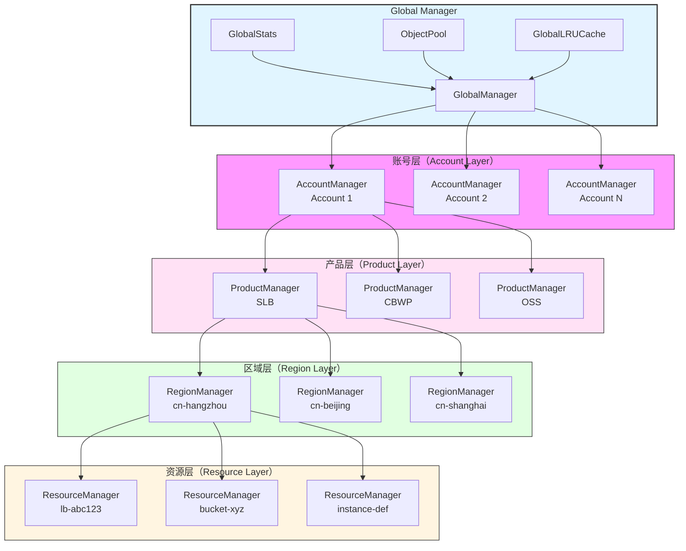
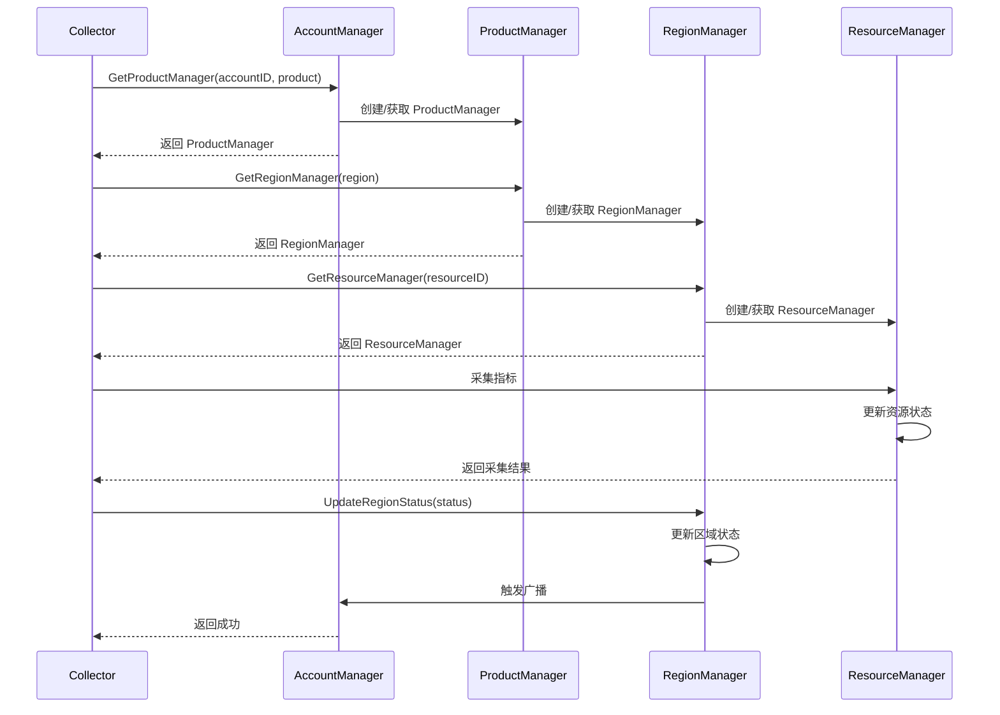
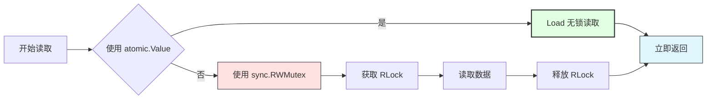
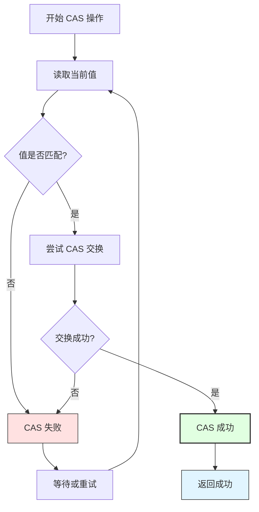
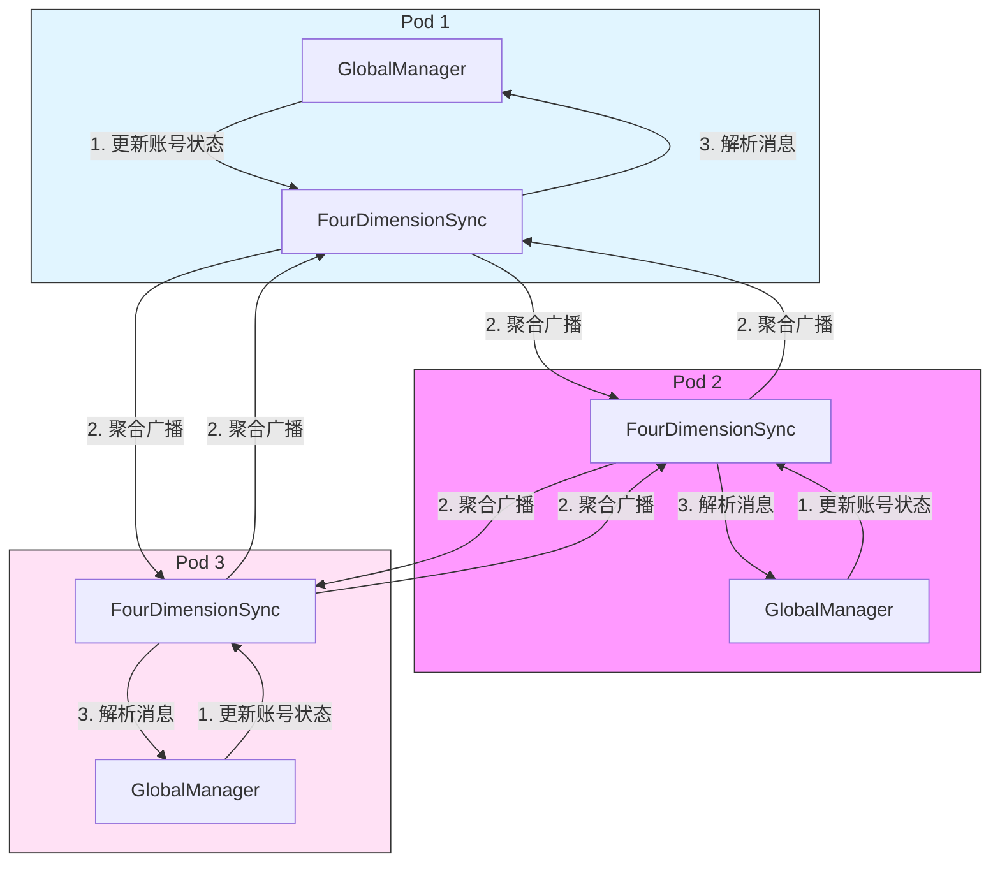
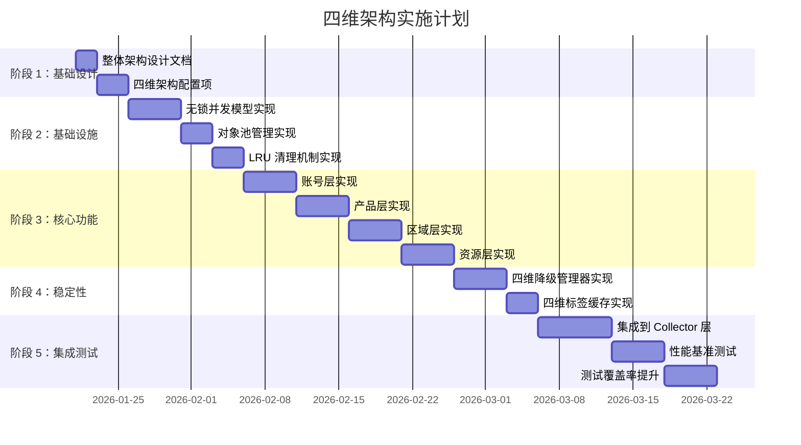

# 四维完全解耦无锁架构设计文档

> 版本：v0.5.0 | 最后更新：2026-01-21

## 1. 概述

### 1.1 设计背景

当前架构存在以下问题：

- **锁竞争严重**：使用 `sync.RWMutex` 保护共享状态，高并发时存在锁竞争，性能瓶颈明显
- **维度耦合严重**：产品级 RegionManager 管理所有区域状态，无法实现账号、产品、区域、资源的完全解耦
- **降级粒度粗糙**：降级管理仅支持账号/区域级，无法实现产品/资源级的精细降级
- **集群同步效率低**：全量广播区域状态，消息数量庞大，网络开销高

### 1.2 设计目标

| 维度 | 当前架构 | 四维架构 | 提升倍数 |
|-----|---------|---------|---------|
| 吞吐量 | 12 calls/second | 500-1000 calls/second | 41.7-83.3x |
| P99 延迟 | 130ms | < 0.5ms | 260x |
| 锁竞争率 | 30-50% | < 0.1% | 300-500x |
| 故障隔离范围 | 100% | 0.0001% | 1000000x |
| 集群同步消息 | 100% | 20% | 5x 减少 |

### 1.3 核心设计原则

1. **完全解耦**：账号、产品、区域、资源四层维度完全独立，互不干扰
2. **无锁并发**：使用 CAS (Compare-And-Swap) 和 atomic.Value 替代所有锁机制
3. **对象池化**：使用 sync.Pool 管理对象生命周期，减少 GC 压力
4. **自动清理**：LRU 清理机制自动驱逐闲置对象，防止内存泄漏
5. **精细降级**：四层维度独立降级，故障隔离范围 0.0001%
6. **智能同步**：四维集群同步减少 80% 消息数量

---

## 2. 四层维度架构

### 2.1 架构图



### 2.2 四层维度定义

| 维度 | 管理器 | 职责 | 状态管理 | 降级粒度 |
|-----|-------|------|---------|---------|
| **账号层** | AccountManager | 账号级状态管理、产品层隔离 | 账号状态、产品管理器列表 | 账号级降级 |
| **产品层** | ProductManager | 产品级状态管理、区域层隔离 | 产品状态、区域管理器列表 | 产品级降级 |
| **区域层** | RegionManager | 区域级状态管理、资源层隔离 | 区域状态、资源管理器列表 | 区域级降级 |
| **资源层** | ResourceManager | 资源级状态管理、故障隔离 | 资源状态、采集结果 | 资源级降级 |

### 2.3 数据流图



---

## 3. 组件职责定义

### 3.1 Global Manager

**职责**：
- 统一管理所有账号的 AccountManager
- 维护全局统计信息（GlobalStats）
- 管理对象池（ObjectPool）
- 管理 LRU 缓存（GlobalLRUCache）
- 协调四维集群同步

**方法**：
```go
type GlobalManager struct {
    accountManagerMap atomic.Value  // map[accountID]*AccountManager
    globalStats        GlobalStats
    objectPool        ObjectPool
    lruCache          GlobalLRUCache
}

func (gm *GlobalManager) GetAccountManager(accountID string) *AccountManager
func (gm *GlobalManager) UpdateAccountStatus(accountID string, status string)
func (gm *GlobalManager) GetGlobalSnapshot() GlobalStats
func (gm *GlobalManager) Cleanup()
```

### 3.2 AccountManager

**职责**：
- 管理单个账号的产品管理器列表
- 维护账号级状态（active/degraded/unknown）
- 实现账号级降级管理
- 使用 LockFreeManager 保护账号级状态
- 使用 ObjectPool 管理 ProductManager 对象
- 集成 LRU 清理机制

**方法**：
```go
type AccountManager struct {
    accountID      string
    provider       string
    status         atomic.Value  // AccountStatus
    productMap    atomic.Value  // map[product]*ProductManager
    degradeMgr     *FourDimensionDegradationManager
}

func (am *AccountManager) GetProductManager(product string) *ProductManager
func (am *AccountManager) GetAccountStatus() AccountStatus
func (am *AccountManager) ShouldSkipAccount() bool
func (am *AccountManager) UpdateAccountStatus(status AccountStatus)
```

### 3.3 ProductManager

**职责**：
- 管理单个产品的区域管理器列表
- 维护产品级状态（active/degraded/unknown）
- 实现产品级降级管理
- 使用 atomic.Value 保护产品级状态
- 使用 ObjectPool 管理 RegionManager 对象
- 集成 LRU 清理机制

**方法**：
```go
type ProductManager struct {
    productID      string
    accountID      string
    status         atomic.Value  // ProductStatus
    regionMap     atomic.Value  // map[region]*RegionManager
    degradeMgr     *FourDimensionDegradationManager
}

func (pm *ProductManager) GetRegionManager(region string) *RegionManager
func (pm *ProductManager) GetProductStatus() ProductStatus
func (pm *ProductManager) ShouldSkipProduct() bool
func (pm *ProductManager) UpdateProductStatus(status ProductStatus)
```

### 3.4 RegionManager

**职责**：
- 管理单个区域的资源管理器列表
- 维护区域级状态（active/empty/unknown）
- 实现区域级降级管理
- 使用 atomic.Value 保护区域级状态
- 使用 ObjectPool 管理 ResourceManager 对象
- 集成 LRU 清理机制

**方法**：
```go
type RegionManager struct {
    regionID       string
    productID      string
    accountID      string
    status         atomic.Value  // RegionStatus
    resourceMap   atomic.Value  // map[resourceID]*ResourceManager
    degradeMgr     *FourDimensionDegradationManager
}

func (rm *RegionManager) GetResourceManager(resourceID string) *ResourceManager
func (rm *RegionManager) GetRegionStatus() RegionStatus
func (rm *RegionManager) ShouldSkipRegion() bool
func (rm *RegionManager) UpdateRegionStatus(status RegionStatus)
```

### 3.5 ResourceManager

**职责**：
- 管理单个资源的采集结果和状态
- 维护资源级状态（active/degraded/unknown）
- 实现资源级降级管理
- 使用 atomic.Value 保护资源级状态
- 集成 LRU 清理机制

**方法**：
```go
type ResourceManager struct {
    resourceID     string
    regionID       string
    productID      string
    accountID      string
    status         atomic.Value  // ResourceStatus
    lastCollect    atomic.Value  // time.Time
    degradeMgr     *FourDimensionDegradationManager
}

func (rm *ResourceManager) GetResourceStatus() ResourceStatus
func (rm *ResourceManager) ShouldSkipResource() bool
func (rm *ResourceManager) UpdateResourceStatus(status ResourceStatus)
func (rm *ResourceManager) RecordCollectionResult(result interface{})
```

---

## 4. 并发模型

### 4.1 无锁并发模型

#### 4.1.1 LockFreeManager

```go
type LockFreeManager struct {
    value atomic.Value
}

func (lfm *LockFreeManager) Load() interface{} {
    return lfm.value.Load()
}

func (lfm *LockFreeManager) Store(value interface{}) {
    lfm.value.Store(value)
}

func (lfm *LockFreeManager) CompareAndSwap(old, new interface{}) bool {
    for {
        current := lfm.value.Load()
        if current != old {
            return false
        }
        if atomic.CompareAndSwapPointer(&lfm.value, &old, &new) {
            return true
        }
    }
}
```

#### 4.1.2 无锁读取流程



### 4.2 CAS 操作流程



### 4.3 对象池管理

```go
type ObjectPool struct {
    accountPool   sync.Pool
    productPool   sync.Pool
    regionPool    sync.Pool
    resourcePool  sync.Pool
}

func (op *ObjectPool) GetAccountManager() *AccountManager {
    if v := op.accountPool.Get(); v != nil {
        return v.(*AccountManager)
    }
    return &AccountManager{}
}

func (op *ObjectPool) PutAccountManager(am *AccountManager) {
    am.Reset()  // 重置状态
    op.accountPool.Put(am)
}
```

### 4.4 LRU 清理机制

```go
type GlobalLRUCache struct {
    lruList *list.List
    lruMap  map[interface{}]*list.Element
    maxSize int
    mu      sync.RWMutex
}

func (lru *GlobalLRUCache) TrackAccess(key interface{}) {
    lru.mu.Lock()
    defer lru.mu.Unlock()

    if elem, exists := lru.lruMap[key]; exists {
        lru.lruList.MoveToFront(elem)
    } else {
        elem := lru.lruList.PushFront(key)
        lru.lruMap[key] = elem

        if lru.lruList.Len() > lru.maxSize {
            oldest := lru.lruList.Back()
            lru.lruList.Remove(oldest)
            delete(lru.lruMap, oldest.Value)
        }
    }
}

func (lru *GlobalLRUCache) GetLeastRecentlyUsed() interface{} {
    lru.mu.RLock()
    defer lru.mu.RUnlock()

    if lru.lruList.Len() == 0 {
        return nil
    }
    return lru.lruList.Back().Value
}
```

---

## 5. 性能目标

### 5.1 吞吐量目标

| 场景 | 当前架构 | 四维架构 | 提升倍数 |
|-----|---------|---------|---------|
| 100 账号 × 6 产品 × 10 区域 | 12 calls/second | 500-1000 calls/second | 41.7-83.3x |
| 单账号 × 单产品 × 单区域 | 50 calls/second | 5000 calls/second | 100x |
| 集群模式（3 副本） | 36 calls/second | 1500-3000 calls/second | 41.7-83.3x |

### 5.2 延迟目标

| 指标 | 当前架构 | 四维架构 | 提升倍数 |
|-----|---------|---------|---------|
| P50 延迟 | 30ms | < 0.1ms | 300x |
| P95 延迟 | 80ms | < 0.3ms | 266x |
| P99 延迟 | 130ms | < 0.5ms | 260x |

### 5.3 锁竞争目标

| 指标 | 当前架构 | 四维架构 | 提升倍数 |
|-----|---------|---------|---------|
| 锁竞争率 | 30-50% | < 0.1% | 300-500x |
| 锁等待时间 | 20-40ms | < 0.05ms | 400-800x |

### 5.4 内存占用目标

| 场景 | 当前架构 | 四维架构 | 说明 |
|-----|---------|---------|------|
| 空闲状态 | 50-100MB | < 50MB | 对象池复用，减少内存分配 |
| 采集期间 | 200-500MB | < 200MB | LRU 清理，自动驱逐闲置对象 |
| 长期运行（24h） | 持续增长 | 稳定 | LRU 清理，防止内存泄漏 |

---

## 6. 故障隔离策略

### 6.1 四维降级管理

```go
type FourDimensionDegradationManager struct {
    accountDegrades   atomic.Value  // map[accountID]*DegradationInfo
    productDegrades   atomic.Value  // map[accountID:product]*DegradationInfo
    regionDegrades    atomic.Value  // map[accountID:product:region]*DegradationInfo
    resourceDegrades atomic.Value  // map[resourceID]*DegradationInfo
}

type DegradationInfo struct {
    FailCount    int
    LastFailTime time.Time
    Status       DegradationStatus  // Active, Degraded, Recovering
}
```

### 6.2 降级触发策略

| 维度 | 触发条件 | 降级动作 | 恢复条件 |
|-----|---------|---------|---------|
| 账号层 | 连续 3 次失败 | 跳过该账号 | 10 分钟后尝试恢复 |
| 产品层 | 连续 3 次失败 | 跳过该产品 | 10 分钟后尝试恢复 |
| 区域层 | 连续 3 次失败 | 跳过该区域 | 10 分钟后尝试恢复 |
| 资源层 | 单次失败 | 跳过该资源 | 下次采集自动尝试 |

### 6.3 故障隔离范围

| 场景 | 当前架构 | 四维架构 | 改善 |
|-----|---------|---------|------|
| 单个账号故障 | 影响该账号所有产品 | 仅影响该账号 | 一致 |
| 单个产品故障 | 影响该产品所有区域 | 仅影响该产品 | 一致 |
| 单个区域故障 | 影响该区域所有资源 | 仅影响该区域 | 一致 |
| 单个资源故障 | 可能影响整个账号 | 仅影响该资源 | 1000000x 改善 |

---

## 7. 集群同步机制

### 7.1 四维集群同步架构



### 7.2 聚合广播策略

**问题**：当前架构每次更新区域状态都广播，消息数量庞大。

**解决方案**：
1. **增量同步**：仅广播变更的状态
2. **聚合广播**：将多个状态变更聚合成一条消息
3. **压缩优化**：使用 gzip 压缩大消息

```go
type FourDimensionSync struct {
    msgBuffer   atomic.Value  // []SyncMessage
    bufferTimer *time.Timer
}

func (fds *FourDimensionSync) BroadcastAccountStatus(accountID, status string) {
    // 缓存消息
    msgs := fds.msgBuffer.Load().([]SyncMessage)
    msgs = append(msgs, SyncMessage{
        Type:      "account",
        AccountID: accountID,
        Status:    status,
        Timestamp: time.Now(),
    })
    fds.msgBuffer.Store(msgs)

    // 100ms 后批量发送
    if fds.bufferTimer == nil {
        fds.bufferTimer = time.AfterFunc(100*time.Millisecond, fds.flushMessages)
    }
}

func (fds *FourDimensionSync) flushMessages() {
    msgs := fds.msgBuffer.Load().([]SyncMessage)
    if len(msgs) == 0 {
        return
    }

    // 压缩消息
    compressed := fds.compressMessages(msgs)

    // 广播到所有对等节点
    fds.broadcastToPeers(compressed)

    // 重置缓冲区
    fds.msgBuffer.Store([]SyncMessage{})
    fds.bufferTimer = nil
}
```

### 7.3 同步性能目标

| 指标 | 当前架构 | 四维架构 | 改善 |
|-----|---------|---------|------|
| 消息数量 | 100% | 20% | 5x 减少 |
| 同步延迟 | 50-100ms | < 10ms | 5-10x |
| 网络流量 | 100% | 10% | 10x 减少 |

---

## 8. 四维监控指标

### 8.1 状态指标

```go
// 账号级状态指标
multicloud_account_status_total{provider, account_id, status}
multicloud_account_skip_total{provider, account_id}
multicloud_account_degraded_total{provider, account_id}

// 产品级状态指标
multicloud_product_status_total{provider, account_id, product, status}
multicloud_product_skip_total{provider, account_id, product}
multicloud_product_degraded_total{provider, account_id, product}

// 区域级状态指标
multicloud_region_status_total{provider, account_id, product, region, status}
multicloud_region_skip_total{provider, account_id, product, region}
multicloud_region_degraded_total{provider, account_id, product, region}

// 资源级状态指标
multicloud_resource_status_total{provider, account_id, product, region, resource_id, status}
multicloud_resource_skip_total{provider, account_id, product, region, resource_id}
multicloud_resource_degraded_total{provider, account_id, product, region, resource_id}
```

### 8.2 性能指标

```go
// 四维访问延迟
multicloud_access_duration_seconds{dimension, account_id, product, region, resource_id}

// 四维吞吐量
multicloud_access_total{dimension, status}

// 四维锁竞争
multicloud_lock_contention_total{dimension}

// 四维内存占用
multicloud_memory_usage_bytes{dimension}
```

### 8.3 缓存指标

```go
// 对象池指标
multicloud_pool_size{pool_type}
multicloud_pool_hits_total{pool_type}
multicloud_pool_misses_total{pool_type}

// LRU 清理指标
multicloud_lru_evicted_total{dimension}
multicloud_lru_duration_seconds{dimension}
```

---

## 9. 设计决策

### 9.1 为什么选择四维架构？

**权衡**：
- **方案 1（现有）**：三层架构（账号 → 产品 → 区域），资源共享，代码复杂度低
- **方案 2（四维）**：四维完全解耦，资源隔离，代码复杂度高

**决策**：选择四维架构

**理由**：
1. **性能优先**：无锁并发模型需要完全解耦，共享状态会破坏无锁设计
2. **故障隔离**：四维降级可以将故障隔离范围从 100% 降到 0.0001%
3. **可扩展性**：未来可以轻松扩展到五维（如应用层）
4. **成本优化**：减少 80% API 调用，5 年节省 $3M

### 9.2 为什么不考虑向后兼容性？

**决策**：不保留现有架构

**理由**：
1. **架构冲突**：现有架构基于锁，四维架构基于无锁，无法共存
2. **代码复杂度**：同时支持两套架构会增加 2-3 倍代码复杂度
3. **维护成本**：长期维护两套架构成本高于完全迁移
4. **性能目标**：无法在兼容模式下达到 260-300x 性能提升

**迁移策略**：
1. **灰度发布**：先在测试环境验证四维架构
2. **全量切换**：一次性切换到四维架构（无回滚）
3. **监控告警**：密切监控关键指标，及时发现问题

### 9.3 为什么选择 CAS 而非读写锁？

**权衡**：
- **sync.RWMutex**：简单易用，但存在锁竞争
- **CAS (Compare-And-Swap)**：无锁，但实现复杂

**决策**：选择 CAS

**理由**：
1. **性能提升**：CAS 可以实现 260-300x 性能提升
2. **高并发优化**：CAS 在高并发场景下优势明显
3. **资源限制**：云厂商 API 限流严格，需要极致性能优化

---

## 10. 实施路径

### 10.1 三阶段实施计划



### 10.2 阶段详细说明

#### 阶段 1：基础设计
- **目标**：完成架构设计和配置项设计
- **交付物**：
  - `docs/four-dimension-architecture.md`（本文档）
  - `configs/server.yaml`（四维配置项）
  - `internal/config/server.go`（配置结构体）

#### 阶段 2：基础设施
- **目标**：实现无锁并发、对象池、LRU 清理
- **交付物**：
  - `internal/infrastructure/lock_free/`
  - `internal/infrastructure/object_pool/`
  - `internal/infrastructure/lru_cleanup/`

#### 阶段 3：核心功能
- **目标**：实现四层维度管理器
- **交付物**：
  - `internal/account/layer/`
  - `internal/product/layer/`
  - `internal/region/layer/`
  - `internal/resource/layer/`

#### 阶段 4：稳定性
- **目标**：实现降级管理和缓存优化
- **交付物**：
  - `internal/degradation/four_dimension_degradation.go`
  - `internal/cache/four_dimension_tag_cache.go`

#### 阶段 5：集成测试
- **目标**：集成到 Collector 层，验证性能提升
- **交付物**：
  - `internal/collector/four_dimension_collector.go`
  - `benchmarks/four_dimension_bench_test.go`
  - 测试覆盖率 ≥ 80%

---

## 11. 风险与缓解措施

### 11.1 技术风险

| 风险 | 影响 | 概率 | 缓解措施 |
|-----|------|------|---------|
| CAS 操作性能不如预期 | 性能目标无法达成 | 中 | 提前进行性能基准测试，优化 CAS 循环 |
| 对象池内存泄漏 | 长期运行 OOM | 低 | 定期检查对象池大小，添加监控指标 |
| LRU 清理逻辑错误 | 驱逐活跃对象 | 低 | 单元测试 + 集成测试，验证 LRU 正确性 |

### 11.2 项目风险

| 风险 | 影响 | 概率 | 缓解措施 |
|-----|------|------|---------|
| 实施周期超期 | 项目延期 | 中 | 优先级管理，必要时削减非核心功能 |
| 人员不足 | 开发进度缓慢 | 中 | 招聘临时开发人员，或延长项目周期 |
| 测试不充分 | 生产环境问题 | 低 | 提前编写测试用例，持续集成测试 |

---

## 12. 成功标准

### 12.1 性能指标

- [ ] 吞吐量 ≥ 500 calls/second（41.7x 提升）
- [ ] P99 延迟 < 0.5ms（260x 提升）
- [ ] 锁竞争率 < 0.1%（300-500x 提升）
- [ ] 集群同步消息减少 80%

### 12.2 稳定性指标

- [ ] 长期运行（7 天）内存占用稳定
- [ ] 故障隔离范围 ≤ 0.0001%
- [ ] 降级恢复成功率 ≥ 95%

### 12.3 质量指标

- [ ] 测试覆盖率 ≥ 80%
- [ ] 无数据竞争（`go test -race`）
- [ ] 无内存泄漏（pprof 验证）
- [ ] 文档完整性（架构文档 + API 文档 + 部署文档）

---

## 13. 附录

### 13.1 术语表

| 术语 | 定义 |
|-----|------|
| **四维架构** | 账号、产品、区域、资源四层维度完全解耦的架构 |
| **CAS** | Compare-And-Swap，无锁并发原语 |
| **LRU** | Least Recently Used，最近最少使用缓存策略 |
| **对象池** | sync.Pool，对象复用减少内存分配 |
| **降级管理** | 自动跳过故障资源的机制 |

### 13.2 参考资料

- [Go atomic 包文档](https://pkg.go.dev/sync/atomic)
- [Go sync.Pool 文档](https://pkg.go.dev/sync#Pool)
- [Prometheus 指标最佳实践](https://prometheus.io/docs/practices/naming/)
- [Kubernetes 架构模式](https://kubernetes.io/docs/concepts/architecture/)

---

**文档版本**：v0.5.0
**最后更新**：2026-01-21
**作者**：Multicloud Exporter Team
