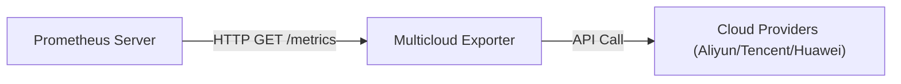

# Prometheus 接入指南

本文档介绍如何配置 Prometheus 以抓取 Multicloud Exporter 暴露的监控指标。

## 1. 交互流程



## 2. 配置接入

### 方式一：标准静态配置 (prometheus.yml)

适用于传统部署或非 Operator 管理的 Prometheus。在 `scrape_configs` 中添加以下作业：

```yaml
scrape_configs:
  - job_name: 'multicloud-exporter'
    # 建议调大抓取超时时间，防止因云 API 延迟导致抓取失败
    scrape_timeout: 30s
    scrape_interval: 60s
    metrics_path: /metrics
    static_configs:
      # 请将 localhost 替换为 Exporter 实际运行的 IP 或域名
      - targets: ['localhost:9101']
```

### 方式二：Kubernetes ServiceMonitor (推荐)

如果您在 Kubernetes 集群中使用 **Prometheus Operator**，推荐通过 Helm Chart 启用的 `ServiceMonitor` 资源进行自动接入。

在部署 Multicloud Exporter 时，修改 `values.yaml`：

```yaml
serviceMonitor:
  enabled: true
  interval: "60s"
  scrapeTimeout: "30s"
  # 根据您的 Prometheus Operator 实例匹配规则配置标签
  labels:
    release: prometheus
```

### 方式三：Kubernetes Annotations

如果您的 Prometheus 通过 Pod Annotations 发现目标，可在 Pod 模板中添加以下注解：

```yaml
metadata:
  annotations:
    prometheus.io/scrape: "true"
    prometheus.io/port: "9101"
    prometheus.io/path: "/metrics"
```

## 3. 验证指标

配置生效后，您可以通过以下步骤验证：

1. 打开 Prometheus UI，进入 **Status -> Targets** 页面。
2. 确认 `multicloud-exporter` 任务的状态为 **UP**。
3. 在 Graph 页面查询 `multicloud_resource_metric` 或 `up` 指标，确认有数据返回。

## 4. 常见问题

- **抓取超时 (Context Deadline Exceeded)**
  - 原因：云厂商 API 响应较慢或采集资源量过大。
  - 解决：增加 `scrape_timeout`（建议 >30s），或调整 Exporter 并发参数。

- **指标中断**
  - 原因：API 限流或认证失败。
  - 解决：检查 Exporter 日志 (`logs/exporter.log` 或 stdout) 确认是否有报错信息。
